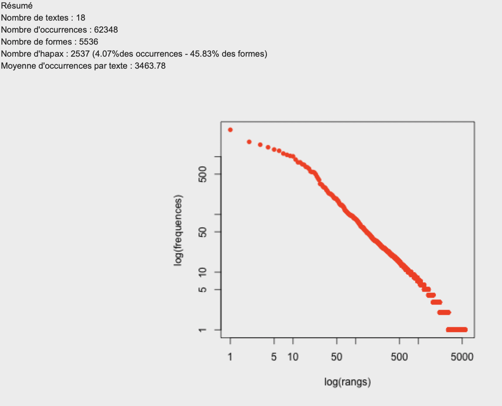
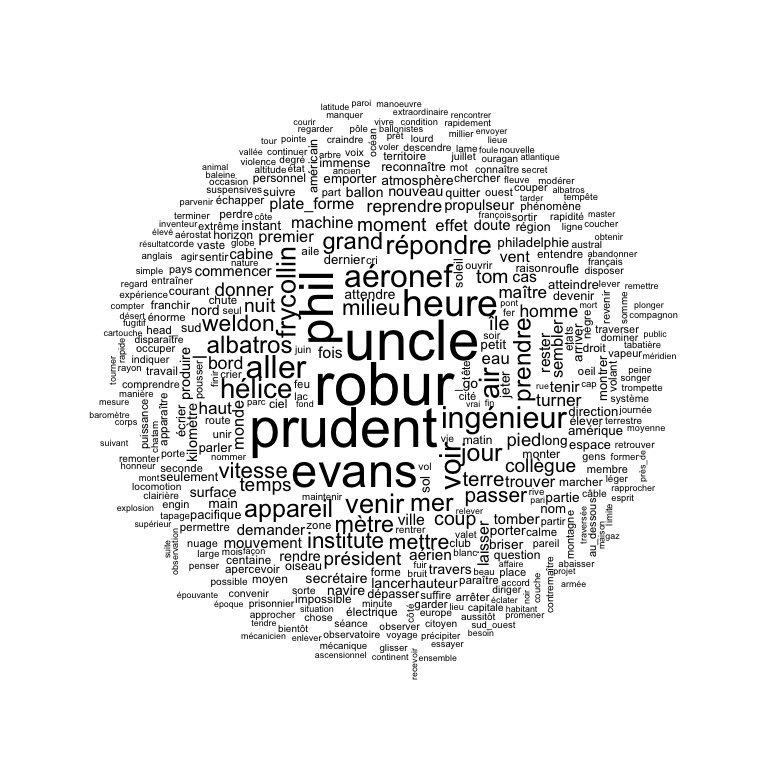
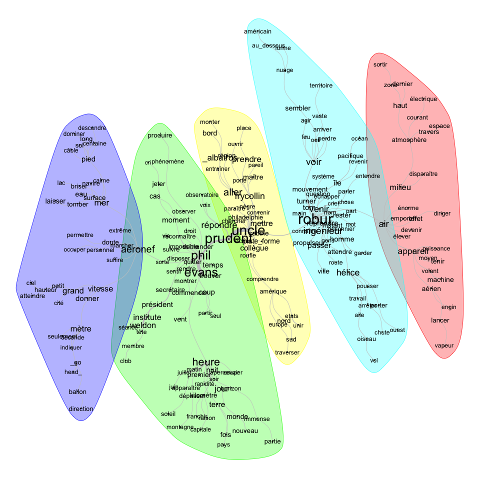
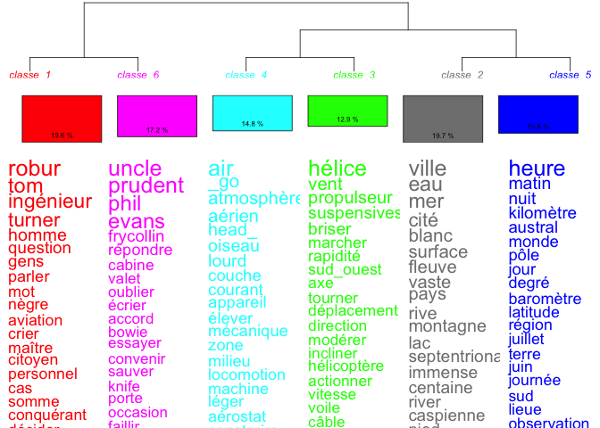
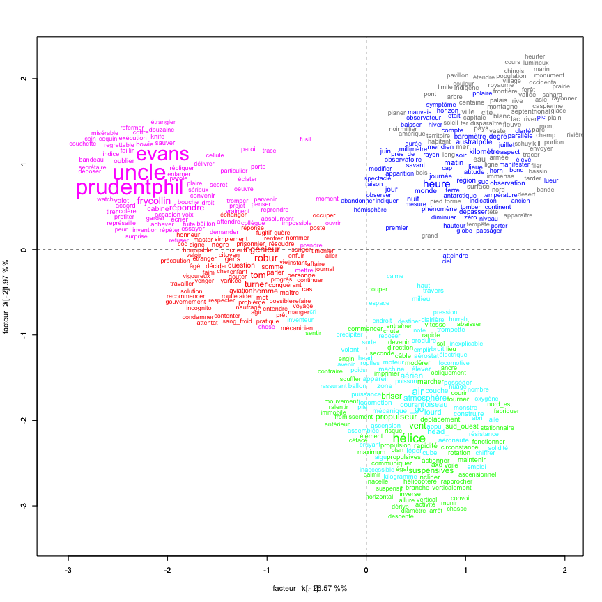
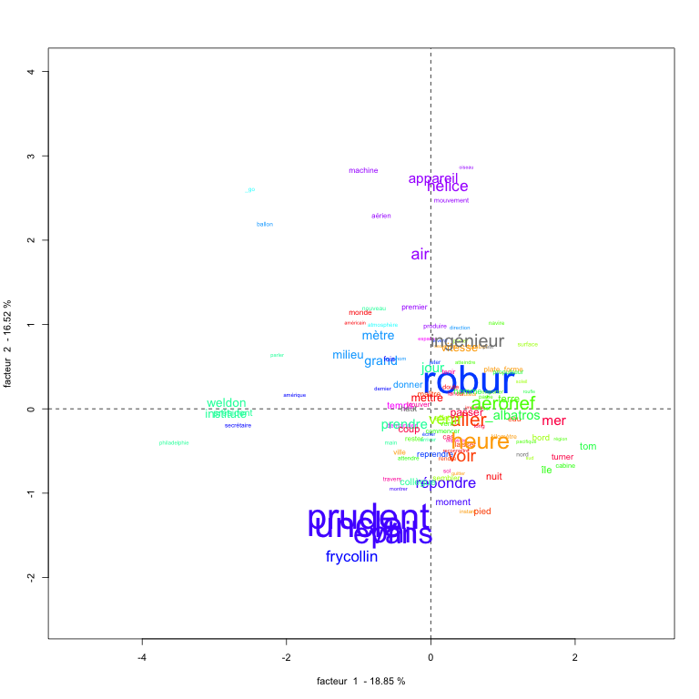
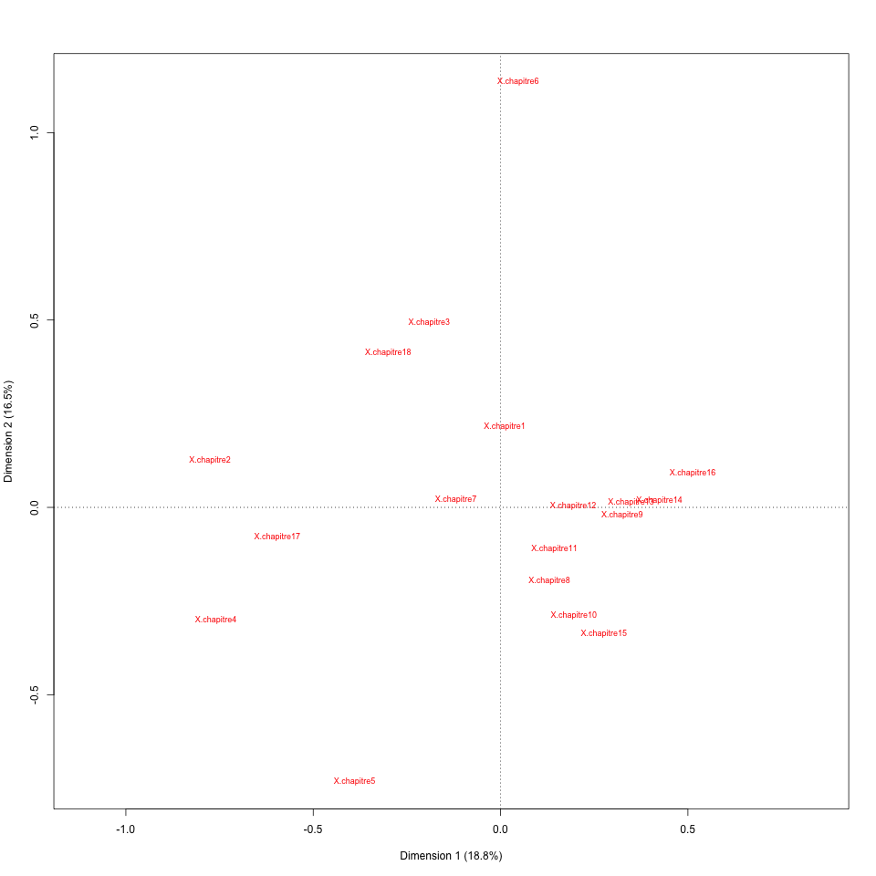

# Document explicatif et descriptif du projet

## Robur le conquérant de Jules Verne 

## Abdelmalek Firas - Master 2 DNHD - Université Bordeaux Montaigne

### Recherche des ressources et formatage du texte

Afin de pouvoir étudier l'ouvrage de Jules Verne «**Robur le conquérant**» il fallait récupérer une version textuelle modulable selon le besoin. Pour ce faire j'ai dû me servir de la version proposée par [wikisource](https://fr.wikisource.org/wiki/Robur_le_conqu%C3%A9rant) qui fournit le texte intégral en deux formats ([TXT](Jules_Verne_Robur_le_conquÇrant.txt) et PDF). J'ai aussi retrouvé d'autres ressources sur [gutenberg](http://www.gutenberg.org/ebooks/5126), notamment d'autres formats ([EPUB](Verne-Robur_le_conquerant.epub) et Kindle).

> Il faut dire qu'avoir la version textuelle au format txt m'a vraiment facilité la tâche car cela m'évite de chercher des solutions pour transformer des fichiers au format (pdf, epub, doc, etc.) en txt, qui suite à ce traitement pourront être susceptibles de contenir plusieurs fautes et/ou erreurs. 

Maintenant que j'ai en ma possession le fichier au format brut, je devais le remettre en forme selon les exigences de l'outil iramuteq. Le fichier source en question était structuré mais je devais séparer les chapitres et surtout supprimer les textes qui ne sont pas en rapport direct avec l’œuvre et son contenu. Un nettoyage nécessaire pour une limitation du bruit et une meilleure analyse.

Cette oeuvre comporte 18 chapitres que j'ai pris en considération pour réaliser le formatage en suivant la documentation d'Iramuteq. La synataxe est comme suit :

> **** *chapitre1

> **** *chapitre2

> ...

> **** *chapitre18

    **** : indique le point de départ et la nature du contenu du corpus, dans notre cas c'est un texte.
    * : indique la variable qui va définir les différentes parties du corpus.

Puis je l'ai sauvegardé sous le nom **Jules_Verne_Robur_le_conquérant.txt**. Il ne reste plus qu'à exploiter ce corpus dans l'outil iramuteq.

### Analyse du corpus

Une fois sur le logiciel et après avoir importé le texte j'ai obtenu ce tableau avec notamment des informations sur le nombre d'occurrences et des parties présentent dans l'ensemble du texte :

On peut remarquer déjà depuis ce logarithme qu'il y une forte densité de mots ayant peu d'occurrences, on peut en déduire donc que l'auteur a tendance à épuiser ces ressources de vocabulaire afin d'enrichir son oeuvre et peut-être attirer l'attention du lecteur en lui poussant à chercher le sens de ces mots.

Suite à l'importation du corpus dans le logiciel iramuteq, on peut désormer avoir plusieurs tableaux CSV permettant de voir la fréquence des mots dans l'oeuvre ainsi que leurs types. Dans mon analyse je n'ai quasiment utilisé que les formes-actives mais j'ai ajouté sous le dossier [csv](csv) les deux autres bases de données ([formes_supplémentaires.csv](csv/formes_supplÇmentaires.csv) et [total.csv](csv/total.csv)).

#### Nuage de mots

Pour commencer, j'ai réalisé une première analyse en nuage de mots afin d'avoir une représentation graphique des mots aux occurrences les plus élevées. Pour que cette représentation soir lisible et plus agréable, j'ai réduit le champ de visualisation à seulement les mots qui ont une fréquence d'apparition plus que 20 fois.

Pour le côté analytique, je trouve que cette représentation n'est pas utile et peu pertinente si on cherche plus de sens et de profondeur.

#### Analyse de similitudes

En réduisant la taille de quelques facteurs et après multiples essais j'ai réussi à obtenir cette représentation de données plus ou moins lisible, qui expose 5 grands blocs qui s'intersectent entre-eux et qui tournent autour des personnages principaux de l'oeuvre avec la présence remarquable de quelques mots tels que "Prudent", "aeronef", "heure", "hélice", "appareil", etc.

#### Classification Reinert et son AFC

Pour voir plus clair j'ai réalisé une classification Reinert qui nous permettra d'avoir des catégories selon une hiérarchie descendante.

Cette classification montre plus de détails et donne plus de sens à l'analyse de similitudes réalisée auparavant. Cela confirme ce qui était dit concernant les mots les plus influents dans le texte, dont je cite les principaux : robur, tom, ingénieur, uncle, prudent, phil, evancs, air, hélice, ville, heure.

En plus de ces classes, on peut aussi représenter les résultats sous forme de AFC en deux dimensions. Une méthode qui nous indique quelles classes sont rapprochées et similaires à d'autres. Dans notre exemple, on constate que les classes sont regroupées en couplets : 

- 1 et 6
- 4 et 3
- 2 et 5

#### Autre analyse factorielle des correspondances

On peut remarquer une certaine densité de mots ayant une forte fréquence d'apparition surtout à partir du milieu de l'ouvrage, plus précisément à partir du 6ème chapitre jusqu'au 16ème chapitre. Les couleurs présentes dans le graphique aident à la distinction de chaque catégorie de mots même si la représentation n'est pas optimale et claire.

#### La question

La réponse à la question du 6ème point se trouve en suivant ce lien : [en quoi la digitalisation de l'oeuvre permet-elle d'envisager de nouvelles possibilités en Humanités Digitales ?](Question_digitalisation-oeuvre.md)
