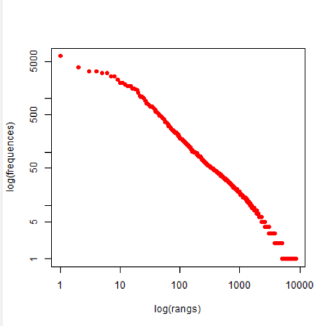
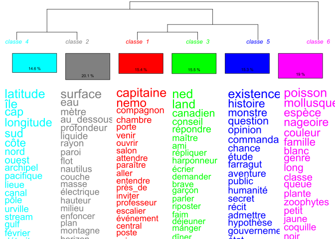
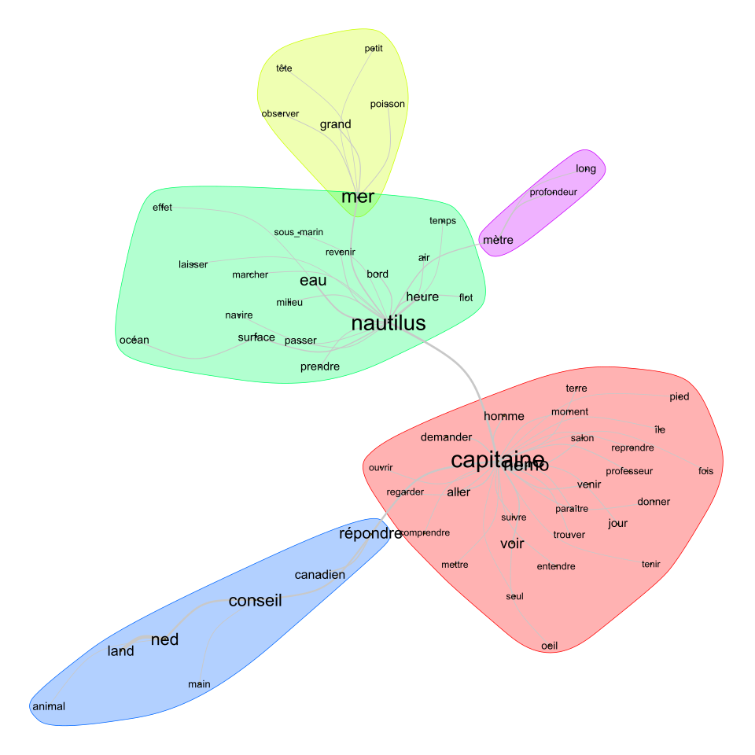
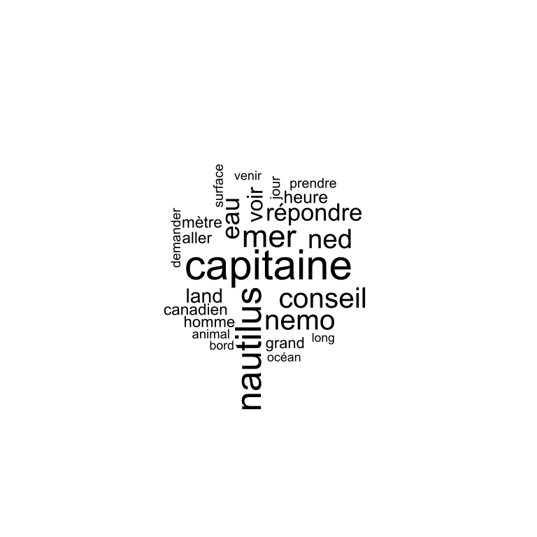
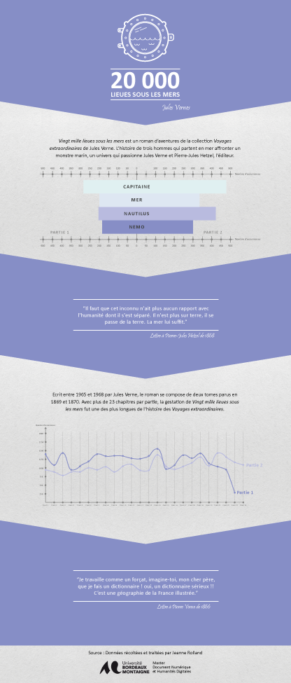

# Analyse textuelle : Vingt mille lieues sous les mers - Jules Verne

*Vingt mille lieues sous les mers* est un roman de Jules Verne qui fait partie de la collection *Voyages extraordinaires* éditée par Pierre-Jules Hetzel. Passionné par la mer, Jules Verne décide d'en faire l'héroïne de son livre qui raconte l'histoire de trois hommes qui partent affronter un monstre marin. Une analyse textuelle effectuée avec le logiciel Iramuteq a permis de mettre en lumière les thématiques abordées dans l'ouvrage. Le déroulement de cette analyse est décrit étape par étape : 

---

## Etape 1 : Récupération et optimisation du texte
Le texte de *Vingt mille lieues sous les mers* est disponible dans la bibliothèque numérique Wikisource : [ici](https://fr.wikisource.org/wiki/Vingt_mille_lieues_sous_les_mers). Il a donc été téléchargé en format ePub puis converti en format texte. Une fois que le texte a été mis au bon format, la suppression des espaces en trop, des retour à la ligne et des légendes a permis de pouvoir l'optimiser pour Iramuteq. En effet, l'ouvrage comportant plus de 40 chapitres, la suppresion de tout ces espaces inutiles a facilité la mise en place des variables qui indique au logiciel les différentes sections du texte. Pour effectuer toutes les analyses principales sur l'ouvrage, il était important de tout d'abord diviser le texte en deux parties (comme dans l'original) grâce aux variables : 

```
**** *Part1
**** *Part2
```
Puis chaque partie a été divisé en fonction de son nombre de chapitre avec les variables : 
```
-*Chap01
-*Chap02
-*Chap03
```
Une fois le texte optimisé pour Iramuteq, il a été enregistré dans le dossier texte sous le nom vingt_mille_lieues_sous_les_mers.txt [disponible ici](texte/vingt_mille_lieues_sous_les_mers.txt) comme le fichier ePub original [disponible ici](texte/vingt_mille_lieues_sous_les_mers.epub) et le fichier CSV comportant toutes les occurrences [disponible ici](texte/occurrences.csv). Le texte a ensuite été importé dans le logiciel pour commencer l'analyse. 

---

## Etape 2 : Analyse du texte
La totalité du texte a été analysé grâce au logiciel de statistique textuelle Iramuteq ce qui a permis de pouvoir faire différents types d'analyse : 

### Analyse statistique
D'un point de vue statistique, le logiciel Iramuteq nous donne tout d'abord des informations générales sur le texte : 
* Nombre de textes : 2 
* Nombre d'occurrences : 147 675
* Nombre de formes : 14894
* Nombre d'hapax : 7352 

Concernant le nombre d'hapax (le nombre de forme qui n'apparaissent qu'une seule fois dans le texte), le logiciel indique qu'il correspond à 49,36% des formes totales du texte (et 2,41% des occurrences), soit pratiquement un mot sur deux qui n'est cité qu'une seule fois.  La représentation graphique produite par l'outil Statistique met en lumière ce nombre d'hapax et appuie cette idée de richesse du vocabulaire de Jules Verne qui sur plus de 600 pages a su utiliser une large variété de formes.


### Méthode Reinert
La méthode ALCESTE (Analyse des Lexèmes Cooccurrents dans un Ensemble de Segments de Textes) développée par le chercheur Reinert dans les années 60, est une méthode qui permet d'appréhender le texte grâce à sa structure, c'est à dire que sa signification peut être saisie grâce à la répétition et à la succession de ses mots. Iramuteq permet d'utiliser cette méthode sur le texte de Jules Verne. Pour ce faire, il faut indiquer au logiciel en combien de classe maximum il doit diviser le texte de façon pertinente. Apres plusieurs tests, le choix s'est porté sur dix classes qui permet au logiciel de diviser le texte en six classes plus pertinentes que si le paramètre avait été supérieur ou inférieur comme le montre le dendrogramme suivant. On y découvre six thèmes principaux qui englobent assez bien tout le contexte de l'ouvrage : 
* Classe 1 : Nemo, l'un des personnages principaux 
* Classe 2 : champ lexical de la mer
* Classe 3 : Ned, l'un des personnages principaux
* Classe 4 : champ lexical d'une ile
* Classe 5 : champs lexical d'un roman
* Classe 6 : champ lexical des animaux marins


### Analyse des similitudes
Tout comme la méthode Reinert, l'outil d'analyse des similitudes permet de mettre en lumière les liens, les similitudes entre les entités d'un corpus. Avec Iramuteq et après de nombreux tests graphiques, la représentation graphique la plus pertinente a été réalisé avec les formes qui sont le plus répétées (plus de 100 répétitions soit 62 formes), ainsi que la présentation fruchterman reingold. Elle nous indique cinq grands thèmes qui viennent compléter les classes de la méthode Reinert : 

En effet, on distingue de grandes entités déjà connues comme Nemo, Capitaine, Ned, Mer et une autre qui manquait aux résultats de la méthode Reinert : Nautilus, élément très important dans le récit de Jules Verne.

### Nuage de mot
Le nuage de mot vient affirmer les résultats des précédentes analyses puisqu'il met en valeur les formes les plus utilisés en les distinguant par leurs tailles. Pour ce faire, plusieurs tests ont été effectué avec des paramètres différents afin d'obtenir un résultat cohérent et lisible. Contrairement à l'analyse des similitudes où la sélection des formes s'est effectuée sur celle contant plus de 100 répétitions, ici le nuage de mot ne contiendra que les formes ayant été répété plus de 150 fois. Cela permet d'avoir un nombre de forme plus réduit et donc une meilleure lecture du nuage de mot : 


---

## Etape 3 : Visualisation des données
Le logiciel Iramuteq produit un certain nombre de diagramme plus ou moins lisible. Ne pouvant ni modifier les couleurs, ni les emplacements des entités des diagrammes directement dans le logiciel, j'ai décidé d'utiliser Illustrator afin de produire une infographie à partir des données que j'ai pu analyser. J'ai voulu utiliser Gephi, mais après de nombreuses tentatives pour corriger l'erreur lié à la version de Java de mon ordinateur qui s'affiche au démarrage du logiciel, j'ai préféré me tourner vers Illustrator pour produire une visualisation plus propre des données.

