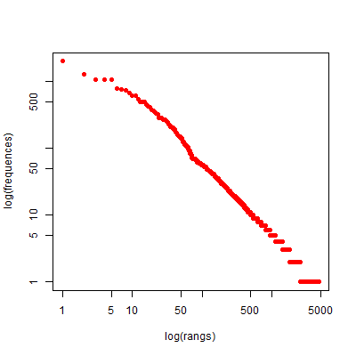
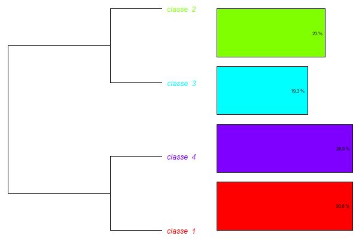
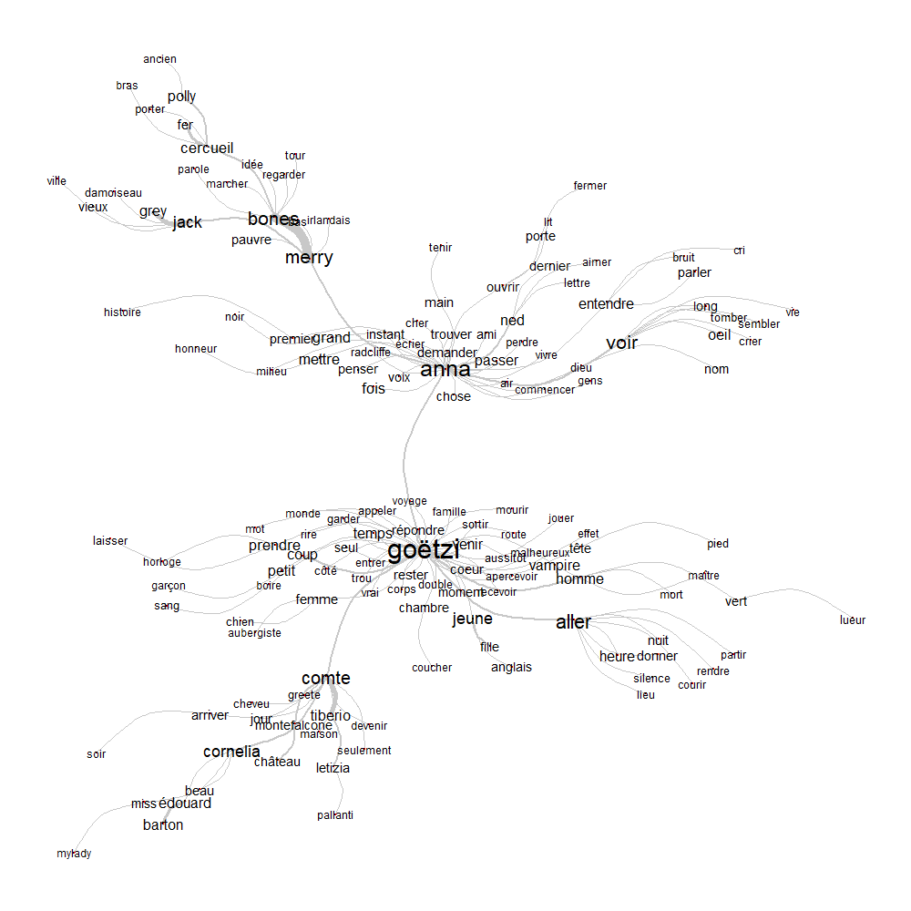
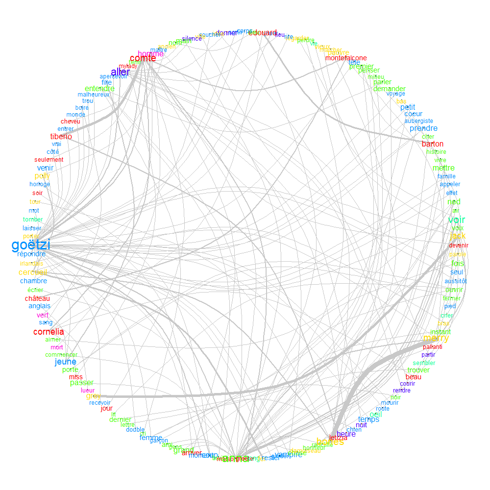
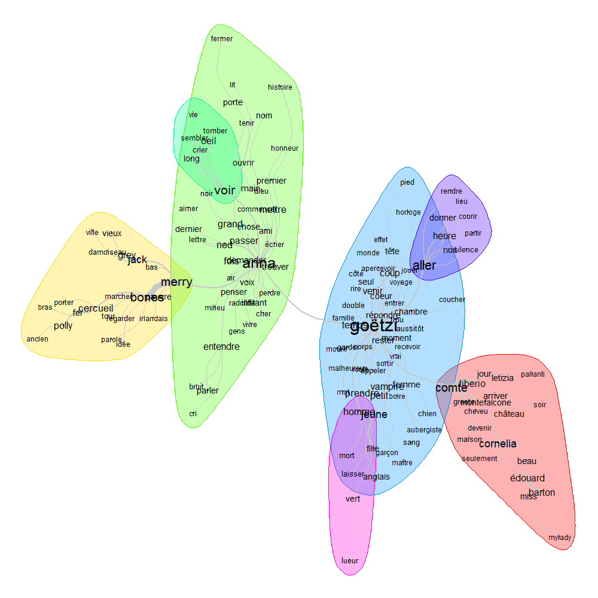
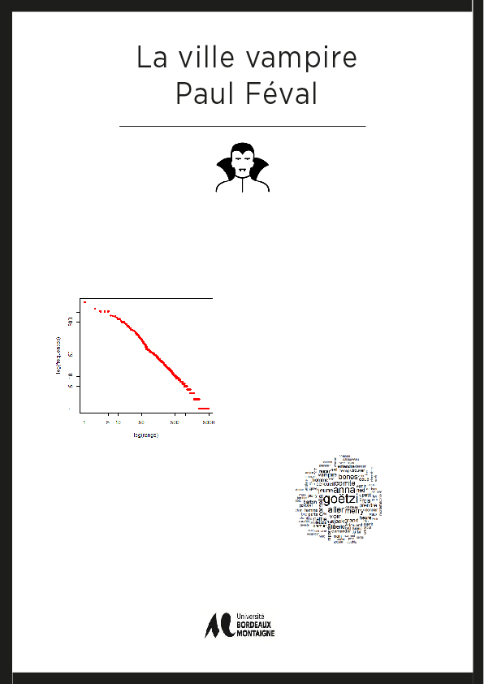

# Document explicatif

## Récupération et mise en forme des données 

L'oeuvre qui me fut donnée à l'étude fut un roman de *Paul Féval : La ville vampire.* 
Pour retrouver ce texte en ligne je me suis tournée vers wikisource et j'ai pu l'obtenir en version PDF. J'ai donc pu grâce à un extracteur de texte le convertir en document texte et le mettre en forme sur Sublime Text. 
Version epub disponible [ici](La Ville Vampire.epub)
Le nettoyage et l'encodage du texte fut relativement simple, ayant fait cela par chapitre celui-ci n'en contenait que deux. 
Cela donna donc : 

---
**** *PREMIÈRE 
 **** *DEUXIÈME PARTIE
---

## Analyse du texte 

L'analyse du texte a été effectuée avec l'aide du logiciel Iramuteq. 

Nous pouvons voir en premier lieu une analyse globale du texte 
Avec comme détails :

Nombre d'occurences : 45073
Nombre de formes : 4720
Nombre d'hapax : 2153

## Classification

Par la suite après avoir installé un package j'ai pu utiliser la méthode Reinart pour mon analyse de texte. 
Cette analyse propose une classification hiérarchique descendante selon la méthode décrit par Reinert

Mon texte fut alors diviser en 4 classes différentes 

Afin de continuer mon analyse je me suis concentrée sur la visualisation de données. 

## Visualisation de données 

### Similitudes 

Pour l'analyse des similitudes sans toucher aux paramètres cela n'était pas très lisible :

Mais en réduisant le nombre de formes et en modifiant des paramètre comme halo ou communauté nous arrivons au fur et à mesure à un résultat plus convaincants :

### Nuage de mots 

Dans le but de rester dans la visualisation de données j'ai donc également réaliser une visualisation grâce au nuage de mots :

### Infographie 

Afin de voir juste un apperçu de ce que pourrait être cette infographie si nous voulions en réaliser une sur cette oeuvre j'ai imaginé une idée de création sur Indesign

